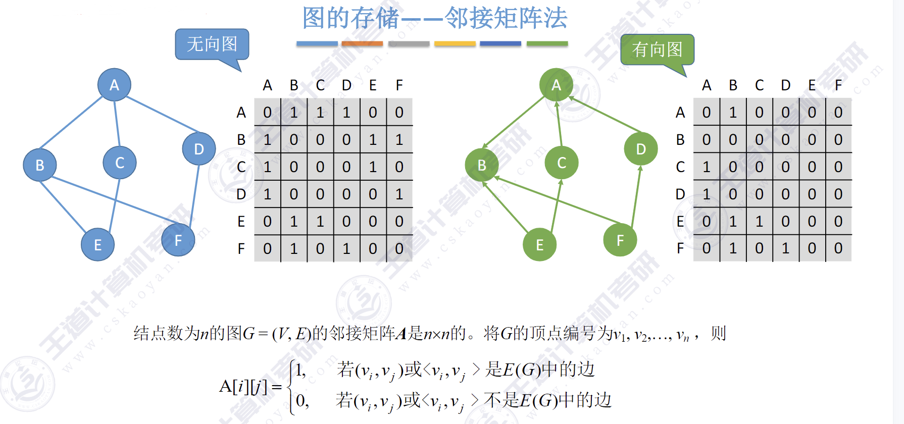
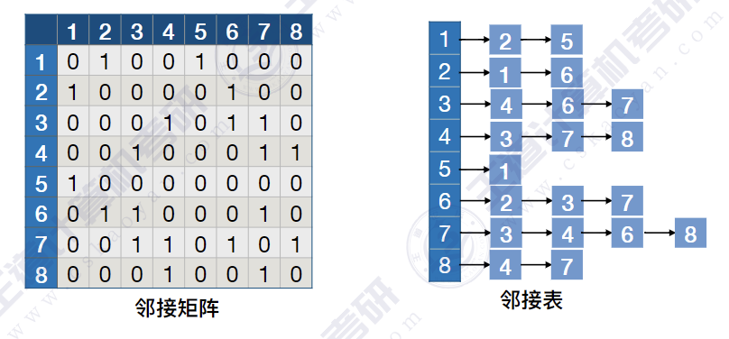

# 图的定义
图G由顶点集和边集E组成，记为$G=(V,E)$.

# 图的存储
## 邻接矩阵法

```c
#define MAXVERTEXNUM 100
#define INFINITY INT_MAX
typedef struct 
{
    char Vex[MAXVERTEXNUM]; //顶点表
    int Edge[MAXVERTEXNUM][MAXVERTEXNUM];//邻接矩阵，边表
    int vexnum,arcnum;  //当前顶点数和弧数
}MGraph;
```
**图的邻接矩阵存储表示法具有以下特点:**
①无向图的邻接矩阵一定是一个对称矩阵(并且唯一)。因此，在实际存储邻接矩阵时只需存储上（或下）三角矩阵的元素。
②对于无向图，邻接矩阵的第$i$行（或第$i$列）非零元素（或非$\infty$元素）的个数正好是顶点$i$的度$TD(v_i)$。
③对于有向图，邻接矩阵的第$i$行非零元素（或非$\infty$元素）的个数正好是顶点$i$的出度$OD(v_i)$;第$i$列非零元素(或非元素)的个数正好是顶点$i$的入度 $ID(v_i)$。
④用邻接矩阵存储图，很容易确定图中任意两个顶点之间是否有边相连。但是，要确定图中有多少条边，则必须按行、按列对每个元素进行检测，所花费的时间代价很大。
⑤稠密图(即边数较多的图)适合采用邻接矩阵的存储表示。
⑥设图$G$的邻接矩阵为$A$，$A^n$的元素$A^n[i][j]$等于由顶点$i$到顶点$j$的长度为$n$的路径的数目。

## 邻接表法
```c
typedef struct ArcNode{     //边
    int adjvex;             //弧指向的结点
    struct ArcNode *next;   //指向下一条弧的指针
    //int Info;             //边权值   
}ArcNode;

typedef struct VNode{   //顶点
    char data;          //顶点信息   
    ArcNode *first;     //指向第一条弧的指针
}VNode,AdjList[MAXVERTEXNUM];

typedef struct ALGraph
{
    AdjList vertices;
    int vexnum,arcnum;
};
```
**图的邻接表存储方法具有以下特点:**
①若$G$为无向图，则所需的存储空间为$O(|V|+2|E|)$;若$G$为有向图,则所需的存储空间为$O(|V|+2|E|)$。前者的倍数2是因为在无向图中，每条边在邻接表中出现了两次。
②对于稀疏图(即边数较少的图)，采用邻接表表示将极大地节省存储空间。
③在邻接表中，给定一个顶点，能很容易地找出它的所有邻边，因为只需要读取它的邻接表。在邻接矩阵中，相同的操作则需要扫描一行，花费的时间为$O(n)$。但是，若要确定给定的两个顶点间是否存在边，则在邻接矩阵中可以立刻查到，而在邻接表中则需要在相应结点对应的边表中查找另一结点，效率较低。
④在无向图的邻接表中，求某个顶点的度只需计算其邻接表中的边表结点个数。在有向图的邻接表中，求某个顶点的出度只需计算其邻接表中的边表结点个数；但求某个顶点x的入度则需遍历全部的邻接表，统计邻接点（adjvex）域为x的边表结点个数。
⑤图的邻接表表示并不唯一，因为在每个顶点对应的边表中，各边结点的链接次序可以是任意的，它取决于建立邻接表的算法及边的输入次序。


# 图的遍历
## 广度优先遍历(BFS)
**要点:**
1. 找到与一个顶点相邻的所有顶点
2. 标记哪些顶点被访问过
3. 需要一个辅助队列

- FirstNeighbor(G,x):求图G中顶点x的第一个邻接点，若有则返回顶点号。若x没有邻接点或图中不存在x，则返回-1。
- NextNeighbor(G,x,y):假设图G中顶点y是顶点x的一个邻接点，返回除y之外顶点x的下一个邻接点的顶点号，若y是x的最后一个邻接点，则返回-1。

- `bool visited [MAX_VERTEX_NUM];//访问标记数组`


```c
void BFS(AMGraph g, int v, bool Visited[]) {
    LinkQueue q;  // 定义一个队列用于存储待访问的顶点
    int e;  // 用于保存从队列中取出的顶点
    InitQueue(&q);  // 初始化队列
    visit(v);  // 访问初始顶点v
    Visited[v] = true;  // 标记顶点v已被访问
    EnQueue(&q, v);  // 将顶点v入队

    while (!IsQueueEmpty(q)) {  // 当队列不为空时循环
        DeQueue(&q, &e);  // 从队列中取出一个顶点e
        for (int w = FirstNeighbor(g, e); w >= 0; w = NextNeighbor(g, e, w)) {  // 遍历顶点e的所有邻接点
            if (!Visited[w]) {  // 如果顶点w未被访问
                visit(w);  // 访问顶点w
                Visited[w] = true;  // 标记顶点w已被访问
                EnQueue(&q, w);  // 将顶点w入队
            }
        }
    }
}

void BFS_L(ALGraph g, int v, bool Visited[]) {
    LinkQueue q;  // 定义一个队列用于存储待访问的顶点
    InitQueue(&q);  // 初始化队列
    visit(v);  // 访问初始顶点v
    Visited[v] = true;  // 标记顶点v已被访问
    EnQueue(&q, v);  // 将顶点v入队

    while (!IsQueueEmpty(q)) {  // 当队列不为空时循环
        int u;
        DeQueue(&q, &u);  // 从队列中取出一个顶点u
        ArcNode* p = g.vertices[u].first;  // 获取顶点u的第一条边
        while (p) {  // 遍历顶点u的所有邻接点
            if (!Visited[p->adjvex]) {  // 如果邻接点p->adjvex未被访问
                visit(p->adjvex);  // 访问邻接点p->adjvex
                Visited[p->adjvex] = true;  // 标记邻接点p->adjvex已被访问
                EnQueue(&q, p->adjvex);  // 将邻接点p->adjvex入队
            }
            p = p->next;  // 指向下一条弧
        }
    }
}

void BFSTraverse(AMGraph g) {   // 广度优先遍历图G，适用于非连通图
    bool Visited[MAXVERTEXNUM] = false;  // 初始化访问标记数组，表示所有顶点都未被访问

    for (int v = 0; v < g.vexnum; v++) {  // 遍历图G中的所有顶点
        if (!Visited[v]) {  // 如果顶点v未被访问
            BFS(g, v, Visited);  // 从顶点v开始进行广度优先遍历
        }
    }
}
```

<font color=red>邻接矩阵</font>存储的图:
访问个顶点需要$O(|V|)$的时间
查找每个顶点的邻接点都需要$ O(IV) $的时间，而总共有$|M|$个顶点时间复杂度=<font color=red>$O(|V|^2)$</font>

<font color=red>邻接表</font>存储的图:
访问$|V|$个顶点需要$O(|V|)$的时间
查找各个顶点的邻接点共需要$O(|E|)$的时间，时间复杂度=<font color=red>$O(|V|+|E|)$</font>


## 深度优先遍历(DFS)

**参考树的先根遍历**
```c
void PreOrder(BiTree T){
    if(T!=NULL){
        visit(T);
        while(T 有下一个子树SubT)
            PreOrder(SubT);
    }
}
```

```c
void DFS(AMGraph g, int v, bool Visited[]) {
    visit(v);  // 访问顶点v
    Visited[v] = true;  // 标记顶点v已被访问
    for (int w = FirstNeighbor(g, v); w >= 0; w = NextNeighbor(g, v, w)) {  // 遍历顶点v的所有邻接点
        if (!Visited[w]) {  // 如果顶点w未被访问
            DFS(g, w, Visited);  // 递归访问顶点w
        }
    }
}

void DFS_L(ALGraph g, int v, bool Visited[]) {
    visit(v);  // 访问顶点v
    Visited[v] = true;  // 标记顶点v已被访问
    ArcNode* p = g.vertices[v].first;  // 获取顶点v的第一条边
    while (p) {  // 遍历顶点v的所有邻接点
        if (!Visited[p->adjvex]) {  // 如果邻接点p->adjvex未被访问
            DFS_L(g, p->adjvex, Visited);  // 递归访问邻接点p->adjvex
        }
        p = p->next;  // 指向下一条弧
    }
}

void DFSTraverse(AMGraph g) {   // 深度优先遍历图G，适用于非连通图
    bool Visited[MAXVERTEXNUM] = false;  // 初始化访问标记数组，表示所有顶点都未被访问
    for (int v = 0; v < g.vexnum; v++) {  // 遍历图G中的所有顶点
        if (!Visited[v]) {  // 如果顶点v未被访问
            DFS(g, v, Visited);  // 从顶点v开始进行深度优先遍历
        }
    }
}
```

**时间复杂度=访问各结点所需时间+探索各条边所需时间**
<font color=red>邻接矩阵</font>存储的图:
访问$|V|$个顶点需要$O(|V|)$的时间
查找每个顶点的邻接点都需要$O(|V|)$的时间，而总共有$|V|$个顶点时间复杂度=<font color=red>$O(|V|^2)$</font>

<font color=red>邻接表</font>存储的图:
访问$|V|$个顶点需要$O(|V|)$的时间
查找各个顶点的邻接点共需要$O(|E|)$的时间,时间复杂度=<font color=red>$O(|V|+|E|)$</font>

# 最小生成树(MST)
## 概念
==连通图。==的生成树是==包含图中全部顶点的一个极小连通子图==。
若图中顶点数为n，则它的生成树含有n-1条边。对生成树而言，若砍去它的一条边，则会变成非连通图，若加上一条边则会形成一个回路。

对于一个==带权连通无向图==$G=(V, E)$，生成树不同，每棵树的权(即树中所有边上的权值之和)也可能不同。设R为G的所有生成树的集合，若T为R中==边的权值之和最小的生成树==，则T称为G的==最小生成树(Minimum-Spanning-Tree, MST)==。
- 如果一个连通图本身就是一棵树,则其最小生成树就是它本身
- 只有连通图才有生成树，非连通图只有生成森林

## Prim算法
从某一个顶点开始构建生成树;每次将代价最小的新顶点纳入生成树，直到所有顶点都纳入为止。

**时间复杂度:$O(|V|^2)$适合用于边稠密图**

**算法实现思想**：

1. 选择图中的任意一个顶点作为起始点，标记为已加入树的集合。
1. 使用一个数组` isJoin[] `来标记哪些顶点已经被加入到生成树中。
2. 使用一个数组` lowCost[] `来存储每个顶点加入生成树的最小代价（边的权值）。
3. 在所有未加入树的顶点中，选择一个与树中已有顶点相连且权值最小的边，将其对应的顶点加入生成树。
4. 更新数组` lowCost[]`，确保每个顶点都记录了从树中最近的顶点的最小代价。
5. 重复上述过程，直到所有顶点都被加入生成树。
6. 当所有顶点都被加入生成树时，算法结束，此时得到的生成树是最小代价生成树。
```c
void PrimAM(AMGraph *G, int start)
{
    int lowcost[MAXVERTEXNUM];   // 存储最小代价
    int closest[MAXVERTEXNUM];   // 存储相应的最小代价边的另一个端点
    int min, minid;

    // 初始化
    for (int i = 0; i < G->vexnum; i++) {
        lowcost[i] = G->Edge[start][i];
        closest[i] = start;
    }
    closest[start] = -1;  // 将起点标记为已加入树

    // Prim算法主循环
    for (int i = 1; i < G->vexnum; i++) {
        min = INFINITY;
        minid = -1;
        // 查找最小代价边
        for (int j = 0; j < G->vexnum; j++) {
            if (closest[j] != -1 && lowcost[j] < min) {
                min = lowcost[j];
                minid = j;
            }
        }

        // 输出最小代价边
        printf("边: %c - %c, 权值: %d\n", G->Vex[closest[minid]], G->Vex[minid], min);

        // 将新顶点加入树
        closest[minid] = -1;

        // 更新lowcost和closest数组
        for (int j = 0; j < G->vexnum; j++) {
            if (closest[j] != -1 && G->Edge[minid][j] < lowcost[j]) {
                lowcost[j] = G->Edge[minid][j];
                closest[j] = minid;
            }
        }
    }
}
```
## Kruskal算法
每次选择一条权值最小的边，使这条边的两头连通(原本已经连通的就不选)直到所有结点都连通

**时间复杂度:$O(|E|log_2|E|)$适合用于边稀疏图**

# 最短路径

## 单源最短路径
### BFS算法(无权图)
```c
// 递归打印路径
void PrintPath(int prev[], int i) {
    if (prev[i] == -1) {  // 递归终止条件
        printf("%d ", i);
        return;
    }
    PrintPath(prev, prev[i]);
    printf("-> %d ", i);
}
// 求顶点u 到其他顶点的最短路径
void BFS_ShortestPath(AMGraph* g, int u) {
    bool Visited[MAXVERTEXNUM] = {false};  // 是否访问标记
    int d[MAXVERTEXNUM];  // d[i] 表示从 u 到 i 结点的最短路径长度
    int path[MAXVERTEXNUM];  // path[i] 表示最短路径中每个结点的前一个结点
    LinkQueue q;
    InitQueue(&q);

    for (int i = 0; i < g->vexnum; i++) {
        d[i] = INFINITY;  // 初始化最短路径长度为无穷大
        path[i] = -1;     // 初始化前驱结点为 -1
    }
    d[u] = 0;           // 起始点到自身距离为 0
    Visited[u] = true;  // 标记起始点已访问
    EnQueue(&q, u);     // 起始点入队

    while (!IsQueueEmpty(q)) {
        int current;
        DeQueue(&q, &current);
        for (int w = FirstNeighbor(*g, current); w >= 0; w = NextNeighbor(*g, current, w)) {
            if (!Visited[w]) {
                d[w] = d[current] + 1;    // 更新最短路径长度
                path[w] = current;        // 记录前驱结点
                Visited[w] = true;  // 标记结点已访问
                EnQueue(&q, w);     // 邻接点入队
            }
        }
    }
    // 输出最短路径信息
    for (int i = 0; i < g->vexnum; i++) {
        printf("Shortest path from vertex %d to vertex %d is %d\n", u, i, d[i]);
        PrintPath(path,i);
        printf("\n");
    }
}
```

### Dijkstra算法(有权图、无权图)

**基本原理**
1. **初始化：** 将所有节点的最短路径估计初始化为无限大（表示尚未找到实际路径），除了源点，其值初始化为0（从源点到自身的距离）。
2. **节点选择：** 选择与源点距离最短的节点作为当前处理节点。这一选择基于贪心策略，以保证每一步都处理当前已知路径最短的节点。
3. **松弛操作：** 对当前处理节点的每一个未处理邻接节点进行松弛操作，尝试通过当前节点更新邻接节点的最短路径估计。松弛操作的核心是检查是否存在更短的路径到达邻接节点。
\[if: d[u]+w(u,v)<d[v]\\\\\\then: d[v]=d[u]+w(u,v)\]

```c
// 寻找距离最近的未访问顶点
int MinDistance(int dist[], bool sptSet[], int V) {
    int min = INFINITY, min_index;

    for (int v = 0; v < V; v++) {
        if (sptSet[v] == false && dist[v] <= min) {
            min = dist[v], min_index = v;
        }
    }

    return min_index;
}

// 递归打印路径
void PrintPath(int prev[], int i) {
    if (prev[i] == -1) {  // 递归终止条件
        printf("%d ", i);
        return;
    }
    PrintPath(prev, prev[i]);
    printf("-> %d ", i);
}

// 打印从源点到各个顶点的最短距离和路径
void PrintSolution(int dist[], int prev[], int V, int src) {
    printf("Vertex \t Distance from Source\tPath\n");
    for (int i = 0; i < V; i++) {
        printf("%d \t\t %d\t\t", i, dist[i]);
        PrintPath(prev, i);
        printf("\n");
    }
}

// Dijkstra算法实现，求从源点到所有顶点的最短路径
void Dijkstra(AMGraph* g, int src) {
    int V = g->vexnum;       // 顶点个数
    int dist[MAXVERTEXNUM];  // 存储源点到每个顶点的最短距离
    bool sptSet[MAXVERTEXNUM];  // sptSet[i]为true表示顶点i在最短路径树中
    int prev[MAXVERTEXNUM];  // prev[i]表示从源点到i的最短路径上的前一个顶点

    // 初始化所有顶点的距离为无穷大，sptSet[]为false
    for (int i = 0; i < V; i++) {
        dist[i] = INFINITY;
        sptSet[i] = false;
        prev[i] = -1;  // 初始化前驱节点为-1，表示无前驱
    }

    // 源点到自身距离为0
    dist[src] = 0;

    // 找到从源点到所有其他顶点的最短路径
    for (int count = 0; count < V - 1; count++) {
        // 从尚未处理的顶点中选择距离最小的顶点
        int u = MinDistance(dist, sptSet, V);

        // 将选中的顶点加入到最短路径树中
        sptSet[u] = true;

        // 更新邻接顶点的距离值
        for (int v = 0; v < V; v++) {
            if (!sptSet[v] && g->Edge[u][v] != 0 && dist[u] != INFINITY &&
                dist[u] + g->Edge[u][v] < dist[v]) {
                dist[v] = dist[u] + g->Edge[u][v];
                prev[v] = u;  // 更新前驱节点
            }
        }
    }

    // 打印最短路径结果
    PrintSolution(dist, prev, V, src);
}
```