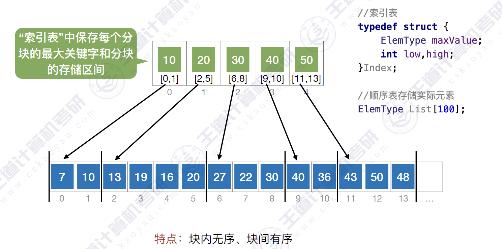

# 查找的基本概念
查找长度——在查找运算中，需要对比关键字的次数称为查找长度
平均查找长度(ASL, Average Search Length)——所有查找过程中进行关键字的比较次数的平均值。

\[ ALS=\sum^n_{i=0}P_iC_i \]

# 顺序查找

# 折半查找
仅适用于有序的顺序表。
```c
int BSearch_R(int a[], int left, int right, int target) {
    if (left <= right) {
        int mid = (left + right)/2;
        if (a[mid] == target)
            return mid;
        if (a[mid] > target)
            return BSearch_R(a, left, mid - 1, target);
        if (a[mid] < target)
            return BSearch_R(a, mid + 1, right, target);
    }
    return -1;
}

int BSearch(int a[],int len,int target){
    int left=0,right=len-1;
    while (left<=right)
    {
        int mid =left+(left+right)/2;
        if(a[mid]==target)
            return mid;
        if(a[mid]<target)
            left=mid+1;
        else
            right=mid-1;
    }
    return -1;
}
```
# 分块查找

设索引查找和块内查找的平均查找⻓度分别为$L_I$、$L_S$，则分块查找的平均查找长度为
\[ASL=L_I + L_S\]
用==顺序查找查索引表==，
则$L_I=\frac{(1+2+...+b)}{b}=\frac{b+1}{2}$,$L_S=\frac{(1+2+...+s)}{s}=\frac{s+1}{2}$,
则$ASL=\frac{b+1}{2}+\frac{s+1}{2}=\frac{s^2+2s+n}{s2}$,当<font color=red>$s=\sqrt{n}$时</font>，$ASL_{最小}=\sqrt{n}+1$

若$n=10000$，则$ASL_{min}=101$

# 二叉排序树
==左子树结点值 < 根结点值 < 右子树结点值==
==进行中序遍历，可以得到一个递增的有序序列==

## 查找
若树非空，目标值与根结点的值比较：
若相等，则查找成功；
若小于根结点，则在左子树上查找，否则在右
子树上查找。
查找成功，返回结点指针；查找失败返回NULL

```c
BSTNode* BST_Search(BSTree t, int target) {
    while (t != NULL) {
        if (t->data == target)
            return t;  // 找到目标节点，返回
        t=(target>t->data)?t->rchild:t->lchild;
    }
    return NULL;  // 未找到目标值，返回NULL
}

//二叉排序树递归搜索
BSTNode* BST_Search_R(BSTree t, int target){
    if(t==NULL)
        return NULL;
    if(t->data==target)
        return t;
    else if(t->data>target)
        return BST_Search_R(t->lchild,target);
    else
        return BST_Search_R(t->rchild,target);
}
```

# 散列表

```c
#define HASHSIZE 13
#define NULLKEY -32768

typedef struct HashTable
{
    int *elem;      // 数据元素存储基址，动态分配数组
    int count;      // 当前数据元素个数
}HashTable;

//初始化散列表
bool InitHashTable(HashTable *h){
    h->count=HASHSIZE;
    h->elem=(int*)malloc(HASHSIZE*(sizeof(int)));
    for(int i=0;i<HASHSIZE;i++){
        h->elem[i]=NULLKEY;
    }
    return true;
}

//散列函数
int Hash(int key){
    return key%13;
}

void InsertHash(HashTable* h,int key){
    int addr=Hash(key);
    while (h->elem[addr]!=NULLKEY){
        addr=(addr+1)%HASHSIZE;
    }
    h->elem[addr]=key;
}

bool SearchHash(HashTable h,int key){
    int addr=Hash(key);
    while (h.elem[addr]!=NULLKEY)
    {
        addr=(addr+1)%HASHSIZE;
        // if(addr==Hash(key))
        //     break;
        // if(h.elem[addr]==key){
        //     return true;
        // }
        if(h.elem[addr]==NULLKEY||addr==Hash(key))
            return false;
    }
    return true;
}
```

