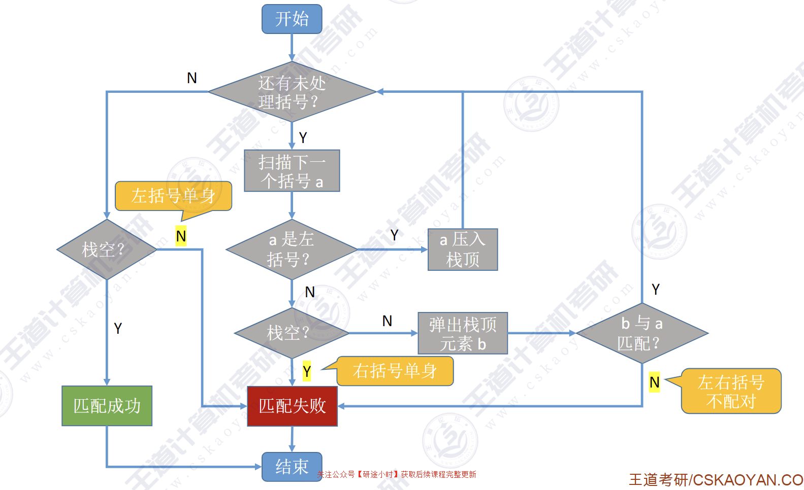
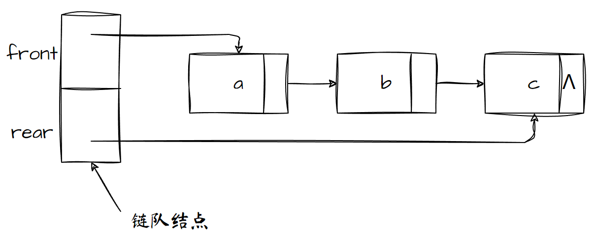
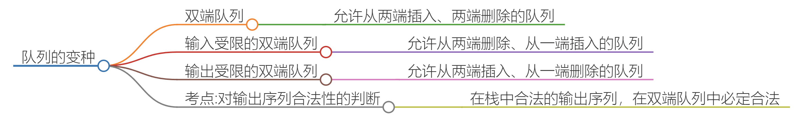
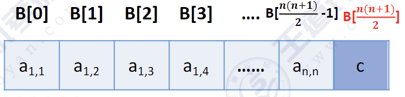
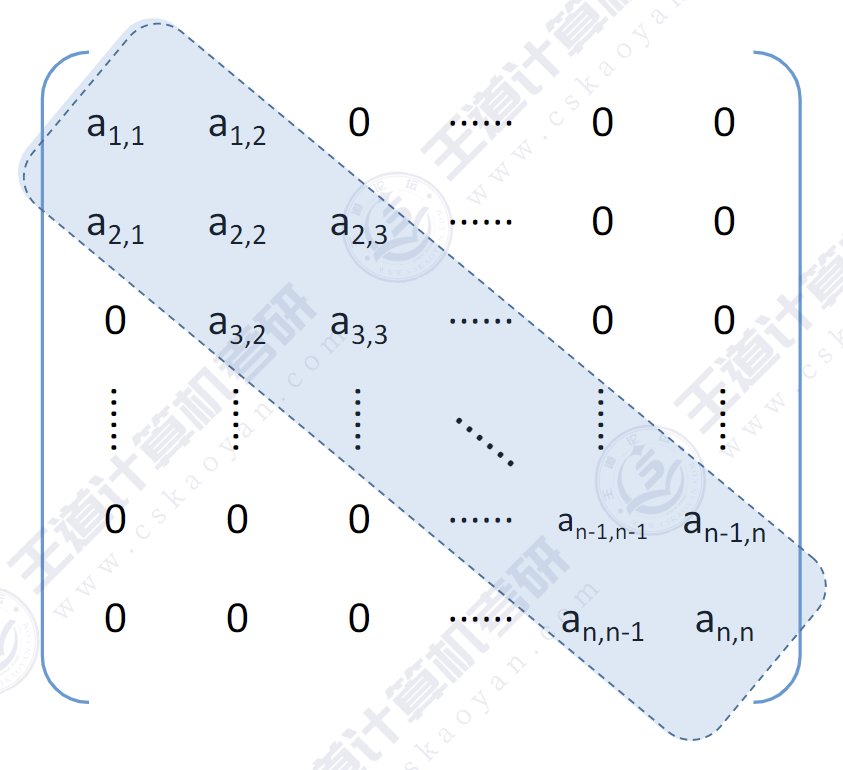
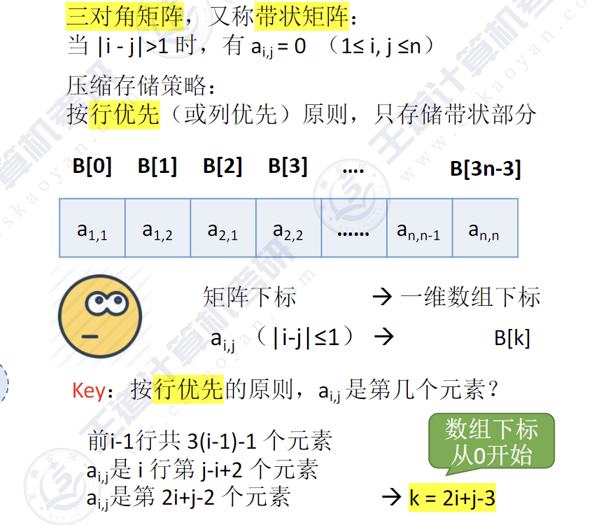

# 栈和队列
## 栈
栈（Stack）是只允许在**一端**进行插入或删除操作的线性表
- 特性:后进先出(LIFO)
### 顺序栈
```c
#define MAXSIZE 10 // 定义栈中元素的最大个数

typedef struct Sequential_stack
{
    int data[MAXSIZE]; // 静态数组字放栈中元素
    int top;           // 栈顶指针
} SqStack;
```
#### 括号匹配

```c
bool BracketCheck(char* str) {
    SqStack S;
    InitStack(&S);
    int i = 0;
    while (str[i] != '\0') {
        if (str[i] == '(' || str[i] == '[' || str[i] == '{') {
            Push(&S, str[i]);
        } else {
            if (EmptyStack(S)) return false;

            char topelem;
            Pop(&S, &topelem);
            if (topelem == '(' && str[i] != ')') return false;
            if (topelem == '[' && str[i] != ']') return false;
            if (topelem == '{' && str[i] != '}') return false;
        }
        i++;
    }
    return EmptyStack(S);
}
```
#### 中缀表达式转后缀表达式
1. **开始**：初始化栈和其他必要变量。
2. **读取输入**：从用户获取中缀表达式。
3. **遍历中缀表达式**：
   - **操作数**：连续读取数字或字母，直到遇到非数字或非字母，将其作为整体添加到后缀表达式中。
   - **左括号**：遇到左括号时，直接压入栈中。
   - **右括号**：遇到右括号时，将栈中的元素弹出并添加到后缀表达式中，直到遇到左括号。弹出左括号但不添加到后缀表达式中。
   - **运算符**：遇到运算符时，比较当前运算符与栈顶运算符的优先级，将栈顶运算符弹出并添加到后缀表达式中，直到栈顶运算符的优先级小于当前运算符或栈为空。然后将当前运算符压入栈中。
4. **处理剩余运算符**：将栈中所有剩余的运算符依次弹出并添加到后缀表达式中。
5. **输出结果**：输出转换后的后缀表达式。
6. **结束**：流程结束。



```c
// 判断字符是否为运算符
bool IsOperator(char c){
    if(c=='+'||c=='-'||c=='*'||c=='/'||c=='^')
        return true;
    else
        return false;
}

// 返回运算符的优先级
int precedence(char op){
    if(op=='+'||op=='-')
        return 1; // '+' 和 '-' 的优先级为 1
    else if(op=='*'||op=='/')
        return 2; // '*' 和 '/' 的优先级为 2
    else if(op=='^')
        return 3; // '^' 的优先级为 3
    return 0; // 其他字符的优先级为 0
}

// 将中缀表达式转换为后缀表达式
void infixToPostfix(char* infix, char* postfix){
    Stack s;
    initStack(&s); // 初始化栈
    int i=0, j=0;
    while (infix[i]!='\0') // 遍历中缀表达式
    {
        if(isdigit(infix[i])||isalpha(infix[i])) // 如果是数字或字母
            postfix[j++]=infix[i]; // 直接添加到后缀表达式中
        else if (infix[i]=='(') // 如果是左括号
        {
            push(&s, infix[i]); // 压入栈中
        }
        else if (infix[i]==')') // 如果是右括号
        {
            // 将栈顶运算符弹出并添加到后缀表达式中，直到遇到左括号
            while (!isEmpty(&s) && peek(&s)!='(')
            {
                postfix[j++]=pop(&s);
            }
            pop(&s); // 删除左括号
        }
        else if(IsOperator(infix[i])){ // 如果是运算符
            // 将栈中优先级高于或等于当前运算符的运算符弹出并添加到后缀表达式中
            while (!isEmpty(&s) && precedence(peek(&s)) >= precedence(infix[i]))
            {
                postfix[j++]=pop(&s);
            }
            push(&s, infix[i]); // 将当前运算符压入栈中
        }
        i++; 
    }
    // 将栈中剩余的运算符全部弹出并添加到后缀表达式中
    while (!isEmpty(&s))
    {
        postfix[j++]=pop(&s);
    }
    postfix[j]='\0'; // 添加字符串结束符
}
```

#### 后缀表达式求值

```c
int EvaluatePostfix(char *postfix) {
    Stack s;
    initStack(&s);
    int i = 0;
    while (postfix[i] != '\0') {
        if (isdigit(postfix[i])) {
            push(&s, postfix[i] - '0'); // 将字符转换为整数
        } else {
            int Rnum = pop(&s);
            int Lnum = pop(&s);
            int result;
            switch (postfix[i]) {
                case '+':
                    result = Lnum + Rnum;
                    break;
                case '-':
                    result = Lnum - Rnum;
                    break;
                case '*':
                    result = Lnum * Rnum;
                    break;
                case '/':
                    result = Lnum / Rnum;
                    break;
                default:
                    printf("无效的运算符: %c\n", postfix[i]);
                    return -1; // 遇到无效运算符时返回 -1
            }
            push(&s, result);
        }
        i++;
    }
    return pop(&s);
}
```

#### 行编辑程序
> 一个简单的行编辑程序的功能是：接受用户从终端输人的程序或数据，并存入用户的数据区。由于用户在终端上进行输人时，不能保证不出差错，因此，若在编辑程序中，“每接受一个字符即存入用户数据区”的做法显然不是最恰当的。较好的做法是，设立一个输入缓冲区，用以接受用户输入的一行字符，然后逐行存人用户数据区。允许用户输入出差错，并在发现有误时可以及时更正。例如，当用户发现刚刚键入的一个字符是错的时，可补进一个退格符“#”，以表示前一个字符无效；如果发现当前键入的行内差错较多或难以补救，则可以键入一个退行符“@”,以表示当前行中的字符均无效。例如，假设从终端接受了这样两行字符：
`whli##ilr#e(s#*s)`
`outcha@putchar(*s=#++):`
则实际有效的是下列两行：
`while (*s)`
`putchar(*s++)；`

```c
void LineEdit() {
    SqStack s;
    InitStack(&s);
    char ch;

    printf("Enter text (use '#' to delete last character, '@' to clear the stack, and EOF to end):\n");
    
    while ((ch = getchar()) != EOF) {
        if (ch == '\n') {
            PrintStack(&s);  // 打印栈的内容作为测试
            ClearStack(&s);
        } else if (ch == '#') {
            char temp;
            Pop(&s, &temp);
        } else if (ch == '@') {
            ClearStack(&s);
        } else {
            Push(&s, ch);
        }
    }
}
```

#### 数制转换
```c
void DecimalToOctal(int decimal) {
    SqStack stack;
    InitStack(&stack);
    
    while (decimal != 0) {
        int remainder = decimal % 8;
        Push(&stack, remainder);
        decimal = decimal / 8;
    }
    printf("八进制数为：");
    while (!IsEmpty(stack)) {
        int elem;
        Pop(&stack, &elem);
        printf("%d", elem);
    }
    printf("\n");
}
```


### 链栈
```c
typedef struct Linked_stack
{
    int data;
    struct Linked_stack *next;
}*LinkStack;
```
- 头插法建立单链表对应进栈
- 对头结点的“后删操作”对应出栈
- 建议使用不带头结点的方法实现


## 队列
队列（Queue）是只允许在一端进行插入，在另一端删除的线性表
- 队列的特点:先进先出First ln First Out(FIFO)

### 队列顺序存储
```c
#define MAXSIZE 10

typedef struct Sequential_queue
{
    int data[MAXSIZE]; // 用静态数组存放队列元素
    int front, rear;   // 定义队头队尾指针
} SqQueue;

```
队列中元素个数：`(rear+MAXSIZE-front)%MAXSIZE`。这种数据结构会空置一个数组元素。

**使用以下数据结构：**

**方案二：**
```c
#define MAXSIZE 10

typedef struct Sequential_queue
{
    int data[MAXSIZE]; // 用静态数组存放队列元素
    int front, rear;   // 定义队头队尾指针
    int size;          // 当前队列长度
} SqQueue;
```
- 初始化时`rear=front=0;size=0;`；
- 插入成功`size++`，删除成功`size--`；
- 队满条件`size==MAXSIZE`。

**方案三**
```c
#define MAXSIZE 10

typedef struct Sequential_queue
{
    int data[MAXSIZE]; // 用静态数组存放队列元素
    int front, rear;   // 定义队头队尾指针
    int tag;           // 记录最近一次操作是删除还是插入
} SqQueue;
```
- 每次删除操作成功时，都令`tag=0`；每次插入操作成功时,都令`tag=1`；
- 只有删除操作，才可能导致队空；只有插入操作，才可能导致队满；
- 初始化时`rear=fornt=0;flag=0;`
- 队列满的条件为`rear==front&&flag=1;`


### 链队
```c
typedef struct Linked_queue //队结点类型定义
{
    int data;
    struct Linked_queue *next;
}LinkNode;

typedef struct              //链队类型定义  
{
    LinkNode *front ,*rear;
}LinkQueue;

```


在对**没有头结点**的队列进行入队操作时,如果队列为空需要单独处理
```c
void EnQueue(LinkQueue *q,int elem){//不带头结点
    LinkNode* s=(LinkNode*)malloc(sizeof(LinkNode));
    s->data=elem;
    s->next=NULL;
    if(q->front=NULL)
    {
        q->front=s;
        q->rear=s;
    }
    else{
        q->rear->next=s;
    q->rear=s;
    } 
}
```
### [双端队列](./双端队列.mm.md)



## 特殊矩阵的压缩存储
### 对称矩阵的压缩存储

- **压缩存储策略:** 只存储主对角线+下三角区(或主对角线+上三角区)，按行优先原则将各元素存入一维数组中。

- **按行优先的原则，$a_{i,j}$是第几个元素?**
    - $a_{i,j}=a_{j,i}$(对称矩阵性质)
    - $k=\begin{cases}\frac{i(i-1)}{2}+j-1,&\quad i\geqslant j\\\frac{j(j-1)}{2}+i-1,&\quad i<j\end{cases}$

### 三角矩阵的压缩存储


- **压缩存储策略**:按行优先原则将橙色区元素存入一维数组中。并在最后一个位置存储常量c。
- **按行优先的原则，$a_{i,j}$是第几个元素？**
    - $k=\begin{cases}\frac{(i-1)(2n-i+2)}{2}+(j-i),&\quad i\leqslant j\\\frac{n(n+1)}{2},&\quad i>j\end{cases}$

### 三对角矩阵的压缩存储




### 稀疏矩阵的压缩存储


