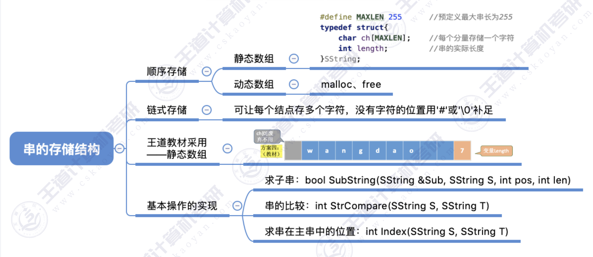
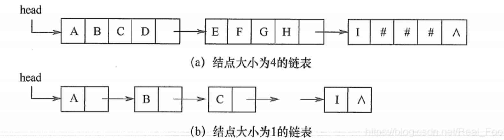

# 串的定义

**串(string)是由零个或多个字符组成的有限序列，又名叫字符串。**
一般记为：$\mathcal{S} = ^\prime$ $a_1$ $a_2$ . . . $a_n^{\prime }$( n> = 0) 。
其中，$\mathcal{S}$是串名，单引号括起来的字符序列是串的值；$\mathfrak{a}_{\mathfrak{n}}$ 可以是字母、数字或其他字符；串中字符的个
数n称为串的长度。

另外还有一些其它概念：

- 空串：n=0时的串称为空串。
- 空格串：是只包含空格的串。注意它与空串的区别，空格串是有内容有长度的，而且可以不止一
个空格。
- 子串与主串：串中任意个数的连续字符组成的子序列称为该串的子串，相应地，包含子串的串称
为主串。
- 子串在主串中的位置就是子串的第一个字符在主串中的序号。

串的逻辑结构和线性表极为相似，区别仅在于串的数据对象限定为字符集。在基本操作上，串和线性表有很大差别。线性表的基本操作主要以单个元素作为操作对象，如查找、插入或删除某个元素等，而串的基本操作通常以子串作为操作对象，如查找，插入或删除一个子串等。

# 串的存储结构

## 1 定长顺序存储表示

类似于线性表的顺序存储结构，用一组地址连续的存储单元存储串值的字符序列。在串的定长顺序存储结构中，为每个串变量分配一个固定长度的存储区，即定长数组。
```c
#define MAXLEN 255	//预定义最大串长为255
typedef struct{
	char ch[MAXLEN];	//每个分量存储一个字符
	int length;	//串的实际长度
}SString;
```

## 2 堆分配存储表示

堆分配存储表示仍然以一组地址连续的存储单元存放串值的字符序列，但它们的存储空间是在程序执
行过程中动态分配得到的。

```c
typedef struct{
	char *ch;	//按串长分配存储区，ch指向串的基地址
	int length;	//串的长度
}HString;
```
在C语言中，存在一一个称之为“堆”的自由存储区，并用malloc()和free()函数来完成动则返回一个指向起始地址的指针，作为串的基地址，这个串由ch指针来指示;若分配失败，则返回NULL。已分配的空间可用free()释放掉。
上述两种存储表示通常为高级程序设计语言所采用。块链存储表示仅做简单介绍。

## 3 块链存储表示
类似于线性表的链式存储结构，也可采用链表方式存储串值。由于串的特殊性(每个元素只有一个字符)，在具体实现时，每个结点既可以存放一个字符， 也可以存放多个字符。每个结点称为块，整个链表称为块链结构。图(a)是结点大小为4 (即每个结点存放4个字符)的链表,最后一个结点占不满时通常用“#”补上;图(b)是结点大小为1的链表。


## 4 串的基本操作

```c
#define MAXLEN 255

typedef struct string
{
    char ch[MAXLEN];
    int length;
}SString;

//字符串比较
int StrCompare(SString s1,SString s2){
    int i=1;
    while (s1.ch[i]==s2.ch[i])
    {
        if (s1.ch[i] == '\0')
            return 0;
        i++;
    }
    return s1.ch[i]-s2.ch[i];
}

//取出字符串S中位置在pos长度为len的子串
bool SubString(SString *sub,SString S,int pos,int len){
    if(pos+len-1>S.length)  return false;
    for(int i=pos;i<pos+len;i++)
        sub->ch[i-pos+1]=S.ch[i];
    sub->ch[len + 1] = '\0'; // 以'\0'结尾
    sub->length=len;
    return true;
}

//判断T是否为S的子串，如果是，返回子串开始位置
int Index(SString S,SString T){
    SString sub;
    int len_s=S.length,len_t=T.length;
    int i=1;
    while (i<len_s-len_t+1)
    {
        SubString(&sub,S,i,len_t);
        if(StrCompare(sub,T)!=0)
            i++;
        else
            return i;
    }
    return -1;
}
```

# 串的模式匹配
## 朴素模式匹配算法
将主串中<font color=Red><b>所有长度为m的子串</b></font>（最多对比 n-m+1 个子串）依次与模式串对比，直到找到一个完全匹配的子串，或所有的子串都不匹配为止。
- 最坏时间复杂度 = $O(nm)$
```c
int Index_2(SString s, SString t) {
    int i = 1;  // 从1开始
    int j = 1;  // 从1开始
    while (i <= s.length) {  // 修改循环条件，确保能够匹配到最后一个可能的位置
        if (s.ch[i] == t.ch[j]) {
            i++;
            j++; 
            if (j > t.length)  // j超过模式串长度时匹配成功
                return i - t.length;
        } else {
            i = i - j + 2;  // i回退到下一起始位置
            j = 1;          // j重置为1
        }
    }
    return 0;
}
```

## KMP算法
