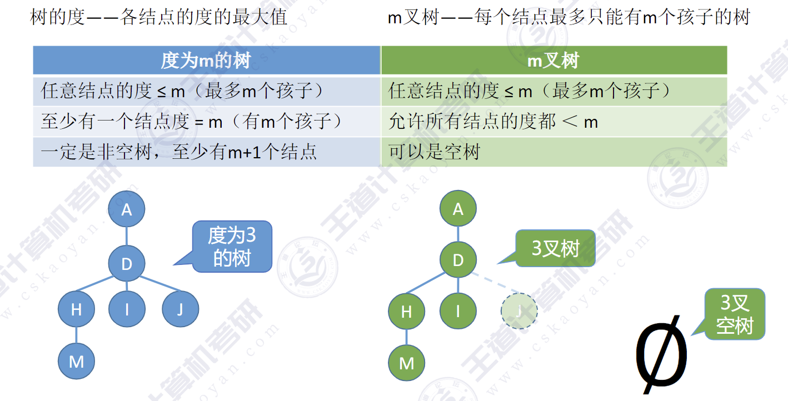
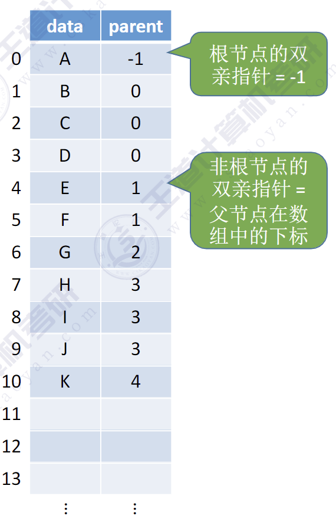
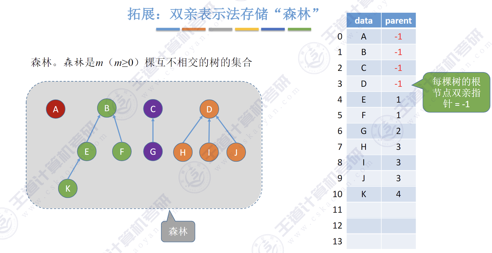
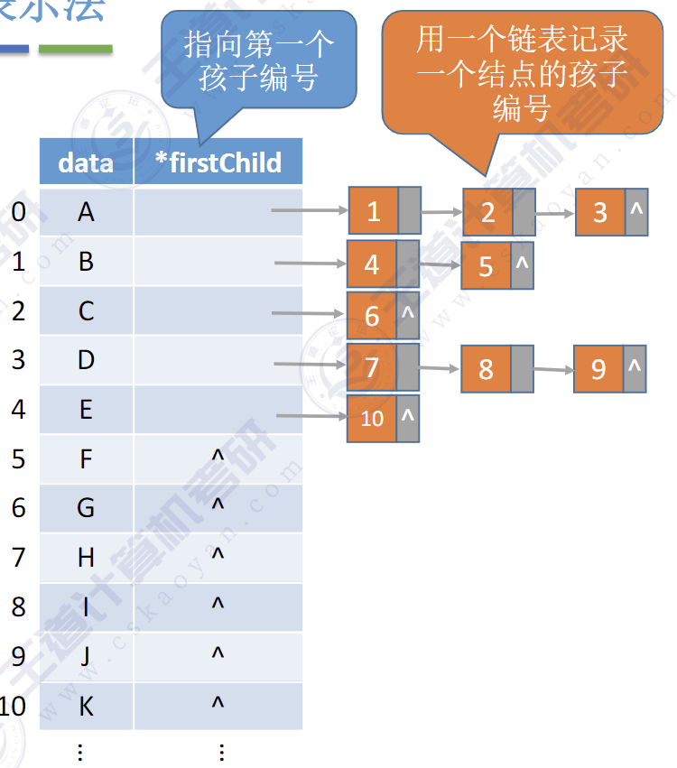
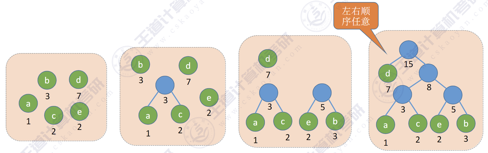

# 树
**常见考点**1：结点数=总度数+1

**常见考点**2:度为m的树、m叉树的区别


**常见考点**3:度为m的树第i层至多有$m^{i-1}$个结点$(i≥1)$，m叉树第i层至多有$m^{i-1}$个结点$(i≥1)$

**常见考点**4:高度为h的m叉树至多有$\frac{m^h-1}{m-1}$个结点。

**常见考点**5:高度为h的m叉树至少有h个结点。高度为h、度为m的树至少有h+m-1个结点。

**常见考点**6:具有n个结点的m叉树的最小高度为$\lceil \log _m\left( n\left( m-1 \right) +1 \right) \rceil $

# 二叉树

**特点**:①每个结点至多只有两棵子树②左右子树不能颠倒(二叉树是有序树)

**常见考点**1:设非空二叉树中度为0、1和2的结点个数分别为$n_0、n_1$，和$n_2$，则$n_0 = n_2+ 1$(叶子结点比二分支结点多一个)

**常见考点**2:二叉树第i层至多有$m^{i-1}$个结点(i≥1)

**常见考点**3:高度为h的二叉树至多有$2^h-1$个结点（满二叉树）

## 完全二叉树

**常见考点**1：具有n个（n > 0）结点的完全二叉树的高度h为$\lceil log_2(n+1) \rceil$或$\lfloor log_2n \rfloor +1$

**常见考点**2:对于完全二叉树，可以由的结点数n推出度为0、1和2的结点个数为$n_0、n_1$和$n_2$

完全二义树最多只有一个度为1的结点，即$n_1=0$或$1$，$n_0 = n_2+1\rightarrow n_0+n_2$一定是奇数

$\downarrow$

若完全二叉树有2k个（偶数）个结点，则必有$n_1=1,n_0=k,n_2=k-1$
若完全二叉树有2k-1个（奇数）个结点，则必有$n_1=0,n_0=k,n_2=k-1$

## 二叉树的顺序存储
二叉树的顺序存储中，==一定要把二叉树的结点编号与完全二叉树对应起来==
- i的左孩子————$2i$
- i的右孩子————$2i+1$
- i的父节点————$\lfloor i/2 \rfloor$


```c
#define MAXSIZE 100

typedef struct tree
{
    int value;
    bool isEmpty;
}TreeNode;

TreeNode t[MAXSIZE];
for (int  i = 0; i < MAXSIZE; i++)
{
    t[i].isEmpty=true;
}
```

## 二叉树的链式存储
```c
// 定义二叉树节点结构体
typedef struct BiTreeNode {
    int data;
    struct BiTreeNode *lchild, *rchild;
} BiTreeNode, *BiTree;
```

## 二叉树的遍历

先序遍历、中序遍历、后序遍历

```c
void PreOrder(BiTree T){
        if(T!=NULL){
        visit(T);
        PreOrder(T->lchild);
        PreOrder(T->rchild);
    }
}
```

## 二叉树的层序遍历

算法思想:
① 初始化一个辅助队列
② 根结点入队
③ 若队列非空，则队头结点出队，访问该结点，并将其左、右孩子插入队尾（如果有的话）
④ 重复③直至队列为空

```c
void LevelOrder(BiTree t){
    LinkQueue q;
    InitQueue(&q);
    BiTree p;
    EnQueue(&q,t);
    while(!IsEmpty(q)){
        DeQueue(&q,&p);
        visit(p);
        if(p->lchild!=NULL)
            EnQueue(&q,p->lchild);
        if(p->rchild!=NULL)
            EnQueue(&q,p->rchild);
    }
}
```

### 求二叉树宽度
【例6-5】 假设二叉树采用二叉链表存储结构存储，设计一个算法，求出该二叉树的宽度(具有结点数最多的那一层上的结点个数)。
```c
```

## 由遍历序列构造二叉树

**结论**:若只给出一棵二叉树的前/中/后/层序遍历序列中的一种，不能唯一确定一棵二叉树

前序+中序遍历序列
后序+中序遍历序列
层序+中序遍历序列               

# 树
## 树的存储结构
**思路**:用数组顺序存储各个结点。每个结点中保存<font color=red>数据元素、指向双亲结点（父节点）的“指针”</font>

### 双亲表示法

```c
#define MAXSIZE 100 //树中最多结点数
typedef struct{     //树的结构定义
    int data;       //数据元素
    int parent;     //双亲位置域
}PTNode;

typedef struct{             //树的类型定义
    PTNode nodes[MAXSIZE];  //双亲表示
    int n;                  //结点数
}PTree;
```
**双亲表示法存储“森林”**


**优点**：找双亲（父节点）很方便
**缺点**：找孩子不方便，只能从头到尾遍历整个数组

### 孩子表示法
孩子表示法:用数组顺序存储各个结点。每个结点中保存数据<font color=red>元素、孩子链表头指针。</font>**顺序存储+链式存储结合**


```c
struct CTNode
{
    int child;          //孩子结点在数组中的位置
    struct CTNode *next;//下一个孩子结点
};

typedef struct 
{
    int data;
    struct CTNode *firstchild;//第一个孩子
}CTBox;

typedef struct 
{
    CTBox nodes[MAXSIZE];
    int n,r;    //结点总数和根的位置
}CTree;
```
**注**：用孩子表示法存储森林，需要记录多个根的位置

**优点**:找孩子很方便
**缺点**:找双亲（父节点）不方便，只能遍历每个链表

### 孩子兄弟表示法

树的==孩子兄弟表示法==，与二叉树类似，采用==二叉链表==实现。每个结点内保存<font color=red>数据元素和两个指针</font>，但两个指针的含义与二叉树结点不同,分别指向第一个孩子和右边兄弟结点

```c
typedef struct CSNode{
    int data;
    struct CSNode *firstchild,*nextsibling;
}CSNode,*SCTree;
```


## 树、森林与二叉树的转换

### 树:arrow_right:二叉树
技巧:
: :one: 先在二叉树中，画一个根节点。
: :two: 按 ==“树的层序”== 依次处理每个结点。

处理一个结点的方法是：如果当前处理的结点在树中有孩子，就把所有孩子结点“用右指针串成糖葫芦”，并在二叉树中把第一个孩子挂在当前结点的左指针下方

### 森林:arrow_right:二叉树
技巧：
: :one: 先把所有树的根结点画出来，在二叉树中用右指针<font color=lighbule>串成糖葫芦</font>
: :two: 按 ==“森林的层序”== 依次处理每个结点。

### 二叉树:arrow_right:树
技巧：
: :one: 先画出树的根节点。
: :two: 从树的根节点开始，按 ==“树的层序”== 恢复每个结点的孩子。

如何恢复一个结点的孩子：在二叉树中，如果当前处理的结点有左孩子，就把左孩子和“一整串右指针糖葫芦”拆下来，按顺序挂在当前结点的下方

### 二叉树:arrow_right:森林
技巧：
: :one: 先把二叉树的根节点和“一整串右指针糖葫芦”拆下来，作为多棵树的根节点
: :two: 从树的根节点开始，按 ==“森林的层序”== 恢复每个结点的孩子。

如何恢复一个结点的孩子：在二叉树中，如果当前处理的结点有左孩子，就把左孩子和“一整串右指针糖葫芦”拆下来，按顺序挂在当前结点的下方

## 树的遍历

# 哈夫曼树
## 哈夫曼树的构造
给定n个权值分别为$w_1,w_2,...,w_n$的结点,构造哈夫曼树的算法描述如下:
1）将这n个结点分别作为n棵仅含一个结点的二叉树,构成森林F。
2）构造一个新结点,从F中进取两棵根结点仅仅最小的树作为新结点的左、右子树,并且将新结点的权值置为左、右子树正根结点的权值之初。
3）从中删除测才选出的两棵树,同时将新得到的树加入F中。
4）重复步骤2）和3）,直至F中只剩下一棵树为止。


1）每个初始结点最终都成为叶结点，且权值越小的结点到根结点的路径长度越大
2）哈夫曼树的结点总数为2n-1
3）哈夫曼树中不存在度为1的结点。
4）哈夫曼树并不唯一，但WPL必然相同且为最优


